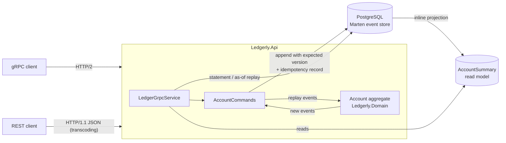
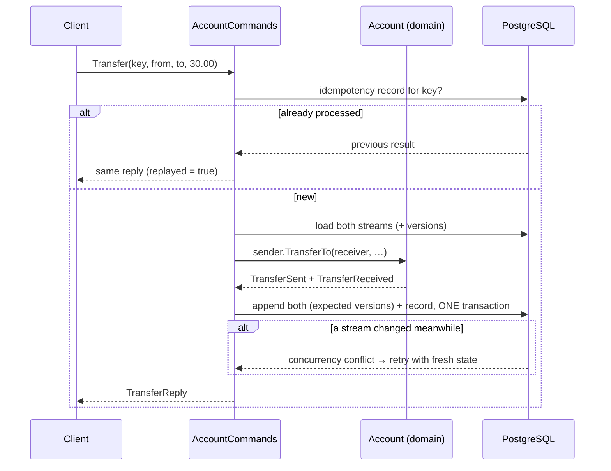

# Ledgerly

[](https://github.com/ebrahimmorkas/ledgerly-event-sourcing/actions/workflows/ci.yml)


An **event-sourced banking ledger** built with **.NET 10**. Accounts are not rows that get updated; they are streams of immutable events (opened, deposited, transferred, frozen, …). The service exposes one API over **gRPC** and, through **JSON transcoding**, as plain **REST**.

## Highlights

- **Event sourcing with Marten** on PostgreSQL: full audit trail by design, nothing is ever overwritten
- **Double-entry transfers**: the debit and credit events on two account streams commit in **one database transaction**, so money is never created or lost
- **Idempotency keys**: retrying a transfer (after a timeout, say) never moves money twice
- **Optimistic concurrency** with expected stream versions and automatic retries: 10 simultaneous withdrawals never overdraw an account (proved by an integration test)
- **Time travel**: `GET /v1/accounts/{id}/balance?as_of=…` returns the exact balance at any past moment
- **Statements** with running and opening balances, derived from the event stream
- **Pure domain model**: business rules return events and have zero infrastructure dependencies, tested Given/When/Then
- **One contract, two protocols**: `ledger.proto` serves gRPC (with reflection) and REST/JSON from the same service

## Architecture



### Transfer flow



## API

| gRPC | REST |
|---|---|
| `OpenAccount` | `POST /v1/accounts` |
| `GetAccount` | `GET /v1/accounts/{id}` |
| `Deposit` | `POST /v1/accounts/{id}/deposits` |
| `Withdraw` | `POST /v1/accounts/{id}/withdrawals` |
| `Transfer` | `POST /v1/transfers` |
| `FreezeAccount` / `UnfreezeAccount` / `CloseAccount` | `POST /v1/accounts/{id}/freeze` · `/unfreeze` · `/close` |
| `GetStatement` | `GET /v1/accounts/{id}/statement?from=&to=` |
| `GetBalanceAt` | `GET /v1/accounts/{id}/balance?as_of=` |

Amounts are decimal strings (`"125.50"`) to avoid floating-point rounding. Domain errors map to gRPC status codes (and the matching HTTP codes for REST): validation → `InvalidArgument` (400), missing → `NotFound` (404), business rule → `FailedPrecondition`, conflicts → `Aborted`.

## Getting started

```bash
docker compose up --build
```

Then, via REST:

```bash
A=$(curl -s -X POST localhost:8080/v1/accounts -H 'Content-Type: application/json' -d '{"owner":"Alice","currency":"EUR"}' | jq -r .accountId)
B=$(curl -s -X POST localhost:8080/v1/accounts -H 'Content-Type: application/json' -d '{"owner":"Bob","currency":"EUR"}' | jq -r .accountId)

curl -s -X POST localhost:8080/v1/accounts/$A/deposits -H 'Content-Type: application/json' -d '{"amount":"100.00","reference":"salary"}'
curl -s -X POST localhost:8080/v1/transfers -H 'Content-Type: application/json' \
  -d "{\"idempotencyKey\":\"invoice-42\",\"fromAccountId\":\"$A\",\"toAccountId\":\"$B\",\"amount\":\"30\",\"reference\":\"invoice 42\"}"

curl -s localhost:8080/v1/accounts/$A/statement | jq
```

Or via gRPC (reflection is enabled):

```bash
grpcurl -plaintext -d "{\"account_id\":\"$A\"}" localhost:8080 ledgerly.v1.Ledger/GetAccount
```

## Tests

```bash
dotnet test                        # domain + statement unit tests
RUN_INTEGRATION=true dotnet test   # + integration tests (needs Docker)
```

- **Domain**: Given/When/Then tests of every rule (overdraft, frozen/closed accounts, double-entry conservation, …)
- **Integration**: the real service against PostgreSQL in **Testcontainers**, called over **both gRPC and REST**: atomic transfers, idempotent retries, concurrent withdrawals, statements and time travel
- **CI** also boots the Docker Compose stack and runs a transfer through the container

## Design decisions

- **Why event sourcing for a ledger?** Money needs an audit trail. With events as the source of truth, history can't be silently rewritten, statements and past balances come for free, and new read models can be built retroactively from existing events.
- **Decisions return events.** `Account.Withdraw(...)` validates and returns `MoneyWithdrawn` without mutating state; state changes only by applying events. The rules are therefore pure functions, trivially testable without a database.
- **Domain free of infrastructure.** The domain project references nothing. The API rebuilds aggregates with the domain's own `Replay` and appends with an explicit expected version, instead of letting the event store's conventions leak into the model.
- **Inline projection for reads.** `AccountSummary` is updated in the same transaction as the events, so reads are simple document loads and are always consistent with writes.
- **gRPC first, REST for free.** A single `.proto` is the contract. Internal services get compact, typed gRPC; browsers and quick integrations get JSON through transcoding, with no second controller layer to keep in sync.

## Project structure

```
src/
  Ledgerly.Domain     Account aggregate, events, rules (no dependencies)
  Ledgerly.Api
    Protos/           ledger.proto (+ google.api annotations for REST mapping)
    Accounts/         AccountCommands, projections, statement builder
    Grpc/             LedgerGrpcService
tests/
  Ledgerly.Domain.Tests
  Ledgerly.Api.Tests  statement unit tests + Testcontainers integration tests
```

## License

[MIT](LICENSE)
